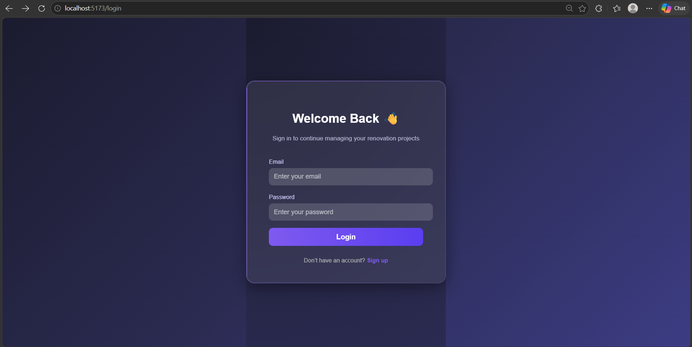
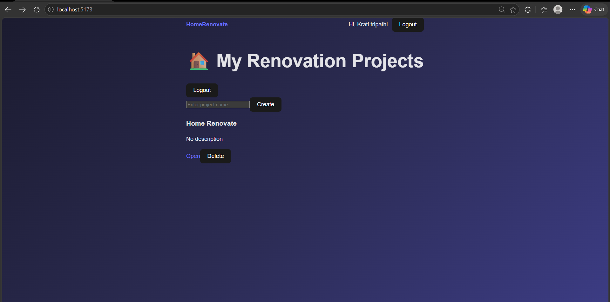

# 🏠 Home Renovation Management System

<p align="center">
  A full-stack web application to manage and streamline home renovation projects, services, and resources efficiently.
</p>

<p align="center">
  
  
  
  
  
</p>

---

## 🌐 Live Demo

🚀 **Frontend:** https://home-renovation-management-system-4.vercel.app  
⚙️ **Backend API:** https://home-renovation-management-system.onrender.com

---

## ✨ Overview

The **Home Renovation Management System** is a scalable and modular web platform designed to simplify the process of managing home renovation projects.

It enables users to:

* Manage renovation projects
* Track tasks and expenses
* Organize materials
* Monitor overall project progress

The system is built using the **MERN stack** and follows a clean, maintainable architecture.

---

## 🎯 Key Features

### 👤 User Features

* 🔐 Secure Authentication (Login / Signup using JWT)
* 🏗️ Create and manage renovation projects
* 📋 Add and track tasks
* 🧱 Manage materials used in projects
* 💰 Track expenses
* 📊 Dashboard overview

### 🛠️ System Features

* RESTful API architecture
* Modular backend (routes, models, middleware)
* Context-based state management (React)
* Clean and responsive UI

---

## 🧰 Tech Stack

| Layer          | Technology                            |
| -------------- | ------------------------------------- |
| Frontend       | React.js, Vite, HTML, CSS, JavaScript |
| Backend        | Node.js, Express.js                   |
| Database       | MongoDB (Mongoose)                    |
| Authentication | JWT, Bcrypt                           |
| Deployment     | Vercel, Render                        |

---

## 📂 Project Structure

```bash
Home-Renovation-Management-System/
│
├── backend/                    
│   ├── config/
│   │   └── db.js             
│   │
│   ├── controllers/           
│   │   ├── authController.js
│   │   └── projectController.js
│   │
│   ├── models/                
│   │   ├── User.js
│   │   └── Project.js
│   │
│   ├── routes/             
│   │   ├── authRoutes.js
│   │   └── projectRoutes.js
│   │
│   ├── middleware/            
│   │   └── authMiddleware.js
│   │
│   ├── server.js            
│   ├── package.json
│   └── .env                  
│
├── frontend/                 
│   ├── public/
│   │
│   ├── src/
│   │   ├── api/
│   │   │   └── axios.js      
│   │   │
│   │   ├── components/
│   │   │   ├── Navbar.jsx
│   │   │   └── ProtectedRoute.jsx
│   │   │
│   │   ├── pages/
│   │   │   ├── Login.jsx
│   │   │   ├── Register.jsx
│   │   │   ├── Dashboard.jsx
│   │   │   └── Home.jsx
│   │   │
│   │   ├── styles/
│   │   │   ├── Login.css
│   │   │   └── Dashboard.css
│   │   │
│   │   ├── App.jsx
│   │   ├── main.jsx
│   │   └── index.css
│   │
│   ├── index.html
│   ├── package.json
│   └── vite.config.js
│
├── screenshots/             
│   ├── login.png
│   └── dashboard.png
│
├── README.md                  
├── .gitignore
└── package.json (optional root)
```

## ⚙️ Getting Started

### 🔹 Clone the Repository

```bash
git clone https://github.com/Stuti985/Home-Renovation-Management-System.git
cd Home-Renovation-Management-System
```

---

### 🔹 Backend Setup

```bash
cd backend
npm install
npm run dev
```

---

### 🔹 Frontend Setup

```bash
cd frontend
npm install
npm run dev
```

---

## 🔐 Environment Variables

Create a `.env` file inside the `backend/` folder:

```env
MONGO_URI=your_mongodb_connection_string
JWT_SECRET=your_secret_key
PORT=5000
```

---

## 📸 Screenshots

### Login


### Dashboard

---

## 🚀 Future Enhancements

* ⭐ User Reviews & Ratings
* 💳 Payment Integration
* 📍 Location-based services
* 🔔 Real-time notifications
* 📱 Fully responsive mobile UI

---

## 🤝 Contributing

Contributions are welcome!

1. Fork the repository
2. Create a new branch (`feature/new-feature`)
3. Commit your changes
4. Push to your branch
5. Open a Pull Request

---

## 👩‍💻 Author

**Stuti Tripathi**
🔗 https://github.com/Stuti985

---

<p align="center">
  Built with ❤️ using the MERN Stack
</p>
